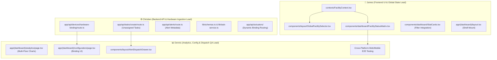

# 🏛️ Team Master Roadmap: Campus-Wide Multi-Floor Web Architecture & Supervisor Dispatch Engine

> **SDCA Annex Campus Edition (4 Floors • 19 Restrooms • 9 Stalls/Facility • 1 PWD/Floor)**  
> *Collaborative Engineering Guide for James, Christian, and Dennis.*

---

## 📌 Executive Architecture & Context

This engineering initiative scales the **Smart Flush Web Application** from a single-toilet prototype into a campus-wide multi-floor operations command center for the **SDCA Annex Building**.

Instead of duplicating dashboard pages, the platform uses a **single unified interface** dynamically driven by:
1. **Global Facility Context (`FacilityContext`)**: Filter by *Campus Overview*, *Specific Floor (1F–4F)*, or *Specific Restroom*.
2. **Interactive 4-Floor Bird's-Eye Status Matrix**: Color-coded real-time health grid (🟢/🟡/🔴) on the main dashboard.
3. **Dynamic Hardware Controller Binding**: Map the single physical ESP32 prototype (`toilet-01`) to any of the 19 rooms on the fly via `/configuration`.
4. **Universal 1-Click Unassigned Dispatch Engine**: Web alerts trigger work orders in the `unassigned` pool (`assignedTo: null`), alerting Mobile Supervisors for real-time technician delegation.

---

## 🎨 Unified Design Standards: Design 3's Framework & WCAG 2.2 AA

All team members' AI models MUST adhere to the shared design system and accessibility guidelines:

### 1. The Design 3's Framework
* **3-Second Comprehension (Glanceability):**
  * Immediate visual hierarchy: facility health is immediately clear via standardized status colors (🟢 Green, 🟡 Yellow, 🔴 Red).
  * No visual clutter; all cards feature crisp subtitles denoting their scope (*"Campus-wide"*, *"Floor 2"*, or *"2F PWD"*).
* **3-Click Maximum Action (Efficiency):**
  * 1-click alert dispatch directly from the header bell drawer.
  * Direct 1-click room filtering via the 4-floor bird's-eye status matrix.
  * Fast dropdown cascades (`Building` $\rightarrow$ `Floor` $\rightarrow$ `Room`) with instant reset.
* **3-State System Feedback (Responsiveness):**
  * Every asynchronous operation must display **Idle** $\rightarrow$ **Loading / In-Flight** (spinners, skeletons, disabled buttons) $\rightarrow$ **Resolved** (Toast notifications + smooth status transitions).

### 2. WCAG 2.2 Level AA Standards
* **Color Contrast:** All text and critical UI elements must exceed the $4.5:1$ contrast ratio against light (`#F7F7F7` / `#FFFFFF`) and dark (`#0B0F19` / `#111827`) backgrounds.
* **Keyboard Navigation:** Full `Tab`, `Arrow Up/Down`, `Enter`, `Escape`, and `Space` keyboard control.
* **Focus Visible Rings:** High-contrast focus rings (`focus-visible:ring-2 focus-visible:ring-primary focus-visible:ring-offset-2`).
* **Semantic ARIA:** Explicit `role="combobox"`, `role="listbox"`, `role="option"`, `role="region"`, `aria-expanded`, and `aria-live="polite"` for dynamic counters.
* **Touch Target Size:** Minimum $44 \times 44\text{px}$ touch targets for all buttons and interactive elements.

### 3. SDCA Institutional Brand Palette

| Color Token | Hex Code | Purpose |
| :--- | :--- | :--- |
| **`sdca-red`** | `#B5121B` | Primary action buttons, active navigation indicators, key brand accents |
| **`sdca-darkred`** | `#8F0D16` | Hover states, secondary brand accents, card top glows |
| **`sdca-gold`** | `#C9A227` | Accent badges, focus rings, warning callouts |
| **`hydro-cyan`** | `#0284C7` | Water volume & flow rate telemetry |
| **`sanitize-indigo`** | `#6366F1` | UV-C germicidal disinfection status |
| **`operational-green`**| `#10B981` | Online status, completed work orders, normal health (🟢) |
| **`advisory-amber`** | `#F59E0B` | Pending tasks, high traffic warnings (🟡) |
| **`critical-crimson`** | `#EF4444` | Sensor anomalies, threshold breaches, active leaks (🔴) |

---

## 🔒 Security & Authorization Audit Rules

1. **Server-Side Token Verification:** Every API endpoint must authenticate requests via `verifyAuthToken(request)` before processing data.
2. **Strict Role-Based Access Control (RBAC):** Check user roles via `getUserRole(user)` (`admin`, `supervisor`, `maintenance`, `viewer`).
   * Only `admin` and `supervisor` can dispatch work orders, trigger actuators, or update hardware bindings.
   * `viewer` accounts have read-only access.
3. **Zod Input Validation:** All request payloads must be strictly validated with `safeParse()` in `lib/schemas.ts` to prevent malicious payloads or invalid data.
4. **Poka-Yoke Safety Confirmation:** Destructive or physical hardware operations (actuators, rule resets, hardware rebinding) must feature confirmation dialogs.
5. **No Data Leakage:** API error responses must return generic error messages without leaking internal stack traces or database IDs.

---

## 👥 Team Ownership & File Boundary Matrix



| Developer | Prompt File | Core Responsibilities | Exclusive Files Owned |
| :--- | :--- | :--- | :--- |
| **James** | [`tasks/TASK_JAMES_FRONTEND.md`](./TASK_JAMES_FRONTEND.md) | Frontend UI, State Management & Dashboard Matrix | `contexts/FacilityContext.tsx`<br>`components/layout/GlobalFacilitySelector.tsx`<br>`components/dashboard/FacilityStatusMatrix.tsx`<br>`components/dashboard/StatCards.tsx` |
| **Christian** | [`tasks/TASK_CHRISTIAN_BACKEND.md`](./TASK_CHRISTIAN_BACKEND.md) | Backend APIs, Hardware Binding, Firestore Schemas | `app/api/devices/hardware-binding/route.ts`<br>`app/api/tasks/create/route.ts`<br>`lib/schemas.ts`<br>`lib/task-service.ts`<br>`lib/task-types.ts` |
| **Dennis** | [`tasks/TASK_DENNIS_ANALYTICS_CONFIG.md`](./TASK_DENNIS_ANALYTICS_CONFIG.md) | Analytics Charts, Config Binding Card, Alert Drawer & QA | `app/(dashboard)/analytics/page.tsx`<br>`app/(dashboard)/configuration/page.tsx`<br>`components/layout/AlertDispatchDrawer.tsx` |

---

## 🗺️ Shared Facility Master Directory (19 Units)

```
SDCA Annex Building (4 Floors)
├── 1st Floor: 1F Canteen (9 Male, 9 Female) + 1F Faculty (9 Male, 9 Female)
├── 2nd Floor: 2F Male Restroom 1 & 2 (9 Stalls each) + 2F Female Restroom 1 & 2 (9 Stalls each) + 2F PWD (1 Stall)
├── 3rd Floor: 3F Male Restroom 1 & 2 (9 Stalls each) + 3F Female Restroom 1 & 2 (9 Stalls each) + 3F PWD (1 Stall)
├── 4th Floor: 4F Male Restroom 1 & 2 (9 Stalls each) + 4F Female Restroom 1 & 2 (9 Stalls each) + 4F PWD (1 Stall)
└── Hardware Lab: SDCA Annex Test Stall (toilet-01)
```

| Floor | Restroom Name | Device ID | Default Lead Technician |
| :--- | :--- | :--- | :--- |
| **1st Floor** | `1F Canteen Male Restroom`<br>`1F Canteen Female Restroom`<br>`1F Faculty Male Restroom`<br>`1F Faculty Female Restroom` | `SDCA-FL1-CANTEEN-M`<br>`SDCA-FL1-CANTEEN-F`<br>`SDCA-FL1-FACULTY-M`<br>`SDCA-FL1-FACULTY-F` | **James Alvarez** (`james@gmail.com`) |
| **2nd Floor** | `2F Male Restroom 1`<br>`2F Male Restroom 2`<br>`2F Female Restroom 1`<br>`2F Female Restroom 2`<br>`2F PWD Restroom` | `SDCA-FL2-M1`<br>`SDCA-FL2-M2`<br>`SDCA-FL2-F1`<br>`SDCA-FL2-F2`<br>`SDCA-FL2-PWD` | **Justine Lopez** (`justine@gmail.com`) |
| **3rd Floor** | `3F Male Restroom 1`<br>`3F Male Restroom 2`<br>`3F Female Restroom 1`<br>`3F Female Restroom 2`<br>`3F PWD Restroom` | `SDCA-FL3-M1`<br>`SDCA-FL3-M2`<br>`SDCA-FL3-F1`<br>`SDCA-FL3-F2`<br>`SDCA-FL3-PWD` | **Maria Lindog** (`maria@gmail.com`) |
| **4th Floor** | `4F Male Restroom 1`<br>`4F Male Restroom 2`<br>`4F Female Restroom 1`<br>`4F Female Restroom 2`<br>`4F PWD Restroom` | `SDCA-FL4-M1`<br>`SDCA-FL4-M2`<br>`SDCA-FL4-F1`<br>`SDCA-FL4-F2`<br>`SDCA-FL4-PWD` | **Supervisor Team** |
| **Lab Unit** | `SDCA Annex Test Stall` | `toilet-01` | *Hardware Diagnostic Unit* |

---

## 🔄 Recommended Git Workflow

Each developer should work on their own feature branch and pull `main` before merging:

```powershell
# James:
git checkout -b feat/james-frontend-matrix

# Christian:
git checkout -b feat/christian-backend-binding

# Dennis:
git checkout -b feat/dennis-analytics-dispatch
```

---

## 🧪 Integration Verification Commands

```powershell
# 1. Verify TypeScript types across all routes and components
npx tsc --noEmit

# 2. Verify ESLint rules
npm run lint

# 3. Test production build
npm run build
```
